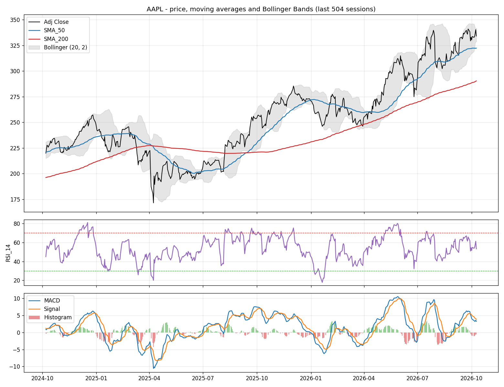

# Task 1 - Financial AI: LLM-Powered Equity Research Assistant

[](https://colab.research.google.com/github/GimsaraK/CDAZZDEV-MLE-Gimsara_Elgiriyage/blob/main/task1_financial/task1_equity_research.ipynb)

An automated equity research assistant. It ingests real market data and news, computes technical indicators from first principles, uses an LLM to reason about sentiment and signals, and produces a structured first-pass research brief.

| Part | Status |
|---|---|
| 1A - Financial data pipeline | Done |
| 1B - LLM sentiment and signal reasoning | Done (Colab notebook run 2026-10-09) |
| Bonus - Report rendering | Done (Markdown + one-page HTML from the notebook run) |

## Contents

| Path | Description |
|---|---|
| `task1_equity_research.ipynb` | Main notebook, executed with outputs visible |
| `src/config.py` | Every tunable constant (windows, thresholds, retry policy, paths) - no magic numbers elsewhere |
| `src/data.py` | yfinance OHLCV + company info, validation and cleaning, snapshot fallback |
| `src/indicators.py` | SMA, EMA, Wilder RMA, RSI, MACD, Bollinger Bands from first principles |
| `src/news.py` | yfinance news + Google News RSS, curation (filtering, de-duplication, per-publisher cap), snapshot fallback |
| `src/summary.py` | Momentum composite signal and the validated `StockSummary` dictionary |
| `src/prompts.py` | System and user prompt templates for sentiment and the Buy/Hold/Sell signal |
| `src/llm.py` | Groq / OpenRouter client, Pydantic validation, repair, sentiment score, signal |
| `src/pipeline.py` | End-to-end orchestration; never raises, returns `ok` / `degraded` / `failed`. LLM stage is opt-in (`run_llm=True`) |
| `src/retry.py`, `src/errors.py`, `src/logging_utils.py` | Retry policy (tenacity), handled exception types, logging setup |
| `tests/` | 123 offline pytest tests (no network) with recorded fixtures |
| `data/` | Committed snapshot (OHLCV CSV, company info, news) used if live sources fail |
| `outputs/` | Technical chart, summary JSON, and the research brief (Markdown + HTML) |
| `src/report.py` | One-page equity research brief from the summary, sentiment, and signal |
| `prompts/` | Placeholder directory. The Task 1B templates live in `src/prompts.py` |

## Part 1A - Financial Data Pipeline

### Design decisions

| Area | Decision | Why |
|---|---|---|
| Ticker | `AAPL` (config constant) | Liquid, consistently positive P/E, abundant news |
| History | `period="3y"` (relative, never hardcoded dates) | Meets the 2-year minimum and leaves 2 full years of valid SMA-200 values |
| Prices | Raw `Close` / `High` / `Low` for current price and 52-week range; `Adj Close` for indicators and YTD | Quoted values match the market; indicators are not distorted by splits or dividends |
| RSI | Wilder smoothing, seeded with the simple average of the first 14 changes | Wilder's original definition |
| EMA | Explicit recursion, alpha = 2/(n+1), seeded with the first price | Transparent first-principles implementation, identical to `ewm(adjust=False)` |
| Bollinger | Population standard deviation (`ddof=0`) | Bollinger's own definition |
| 52-week range | Calendar window (last 52 weeks by date), cross-checked against Yahoo's values | Not shifted by market holidays |
| YTD | Adjusted close vs the last close of the previous calendar year | Standard market convention |
| P/E | `trailingPE`, else price / trailing EPS, else `None` with a stated reason; `forwardPE` reported separately | P/E is meaningless for non-positive EPS |
| Momentum | 7 indicator rules vote +1 / -1 / 0; score = mean of the available votes in [-1, 1], mapped to 5 symmetric labels | Transparent and explainable, with a per-component breakdown that Part 1B reuses |
| News | yfinance news first, Google News RSS (last 7 days) as top-up; low-signal items filtered, de-duplicated, newest first, max 3 per publisher; target 15, minimum 10 | yfinance news currently returns no items, so a keyless second source is essential |
| Robustness | tenacity retries (exponential backoff, full jitter), committed snapshot fallback, Pydantic validation, stage-isolated pipeline | No unhandled exceptions; every degradation is logged and surfaced |

### Verification

- **Unit tests:** `tests/test_indicators.py` checks every indicator against hand-computed values and the [StockCharts RSI worked example](https://chartschool.stockcharts.com/table-of-contents/technical-indicators-and-overlays/technical-indicators/relative-strength-index-rsi), plus edge cases (flat, monotonic, NaN input). The other test modules cover data cleaning, both yfinance news schemas, RSS parsing, curation, snapshot fallback, the P/E chain, the YTD and 52-week logic, the momentum thresholds, and a check that `src/` contains no hardcoded date strings.
- **Independent cross-check:** the notebook compares our indicators with the open-source [`ta`](https://github.com/bukosabino/ta) library (validation only, never used in the pipeline). Over the last two years, every column matches exactly, except RSI, which agrees to within 1.1e-7.

### Results (AAPL, run of 2026-10-09)

The notebook ran at 11:10 US/Eastern while the market was open, so the latest bar is the partial 2026-10-09 session and the current price is intraday.

| Field | Value |
|---|---|
| Current price | 334.15 USD (intraday, 2026-10-09) |
| 52-week high / low | 345.34 / 243.42 (matches Yahoo's values) |
| P/E (trailing) | 38.32 (forward 34.85) |
| YTD return | +23.25% |
| Momentum signal | Bullish (score 0.4286: 5 bullish votes, 2 bearish from MACD vs signal and Bollinger %B) |
| Headlines | 15 from Google News RSS (yfinance returned 0; 27 listing / filing items filtered, per-publisher cap removed 37) |

The full summary dictionary is in [`outputs/AAPL_summary.json`](outputs/AAPL_summary.json) and the chart in [`outputs/AAPL_technical_chart.png`](outputs/AAPL_technical_chart.png).



## Part 1B - LLM Sentiment and Signal Reasoning

### Design decisions

| Area | Decision | Why |
|---|---|---|
| Primary model | Groq `openai/gpt-oss-120b` | Groq retired `llama-3.3-70b-versatile` for free accounts on 2026-08-16; this is the documented replacement |
| Fallback model | OpenRouter `google/gemma-4-31b-it:free` | Llama 3.3 70B on OpenRouter is paid. This id was a zero-price instruction model on the OpenRouter catalog on 2026-10-08 |
| Client | `openai` SDK against each provider's OpenAI-compatible base URL | One wrapper serves both providers |
| Output | JSON mode, then Pydantic on every response | The specification requires validation before use |
| Headlines | One call per headline | One bad response cannot spoil the rest |
| Aggregation | Confidence-weighted mean. positive = +1, negative = -1, neutral = 0. Labels reuse the momentum cut-offs (0.6 strong, 0.2 mild) | Confidence changes the weight of a headline, not just its sign |
| Signal input | Core summary, all 7 momentum votes and flags, latest indicators, per-headline sentiments | The model has to reason about combinations and contradictions |
| Failures | One repair call with the validation error, then the other provider. A headline that still fails is unscored. If the signal fails on both, the result is Hold with `fallback=True` and a reason | Validation failures are logged and do not raise |
| Prompts | Constants in `src/prompts.py`, sent as system and user roles | Prompt text stays out of the business logic |
| Keys | `GROQ_API_KEY` and `OPENROUTER_API_KEY` from Colab Secrets or a gitignored `.env`. Never printed | No credentials in the repo |

### Verification

`tests/test_llm.py` is offline. It checks the weighted-mean formula by hand, rejects bad schemas and justifications outside 3-5 sentences, repairs invalid JSON, falls back from Groq to OpenRouter, and returns a flagged Hold when both providers fail. The notebook's Part 1B cells call the live API when `GROQ_API_KEY` is set. Without it they print a skip message and continue.

### Results (AAPL, run of 2026-10-09)

| Field | Value |
|---|---|
| Sentiment | Neutral, score 0.0309 (15 scored, 0 unscored): negative iPhone 18 Pro demand headlines offset by positive AI and institutional-buying ones |
| Signal | Hold (Groq, fallback=False), 4 sentences combining the SMA trend and golden cross, RSI, a negative MACD histogram, Bollinger %B, and the news score |
| Full pipeline | status `ok`; second pass Neutral -0.0163, Hold |
| Failure demo | Injected `{not json` was rejected by Pydantic, logged, and repaired on Groq |

## Bonus - Equity Research Brief

`src/report.py` writes two files into `outputs/` from the same notebook run:

| File | What it is |
|---|---|
| `outputs/AAPL_research_brief.md` | One-page brief: snapshot, technical outlook, top 3 headlines, recommendation, risk disclaimer |
| `outputs/AAPL_research_brief.html` | The same brief as a styled A4 page, with the matplotlib chart inlined |

The top 3 headlines are the ones with the largest absolute contribution (`confidence` times the +1 / -1 / 0 vote). The disclaimer is a fixed string. The recommendation text is the model's justification, not a second rewrite. Open the HTML file directly from `outputs/`.

## How to Run

**Colab:** open the notebook with the badge above, add `GROQ_API_KEY` (and optionally `OPENROUTER_API_KEY`) in the Secrets panel, and run all cells. The first cell clones this repository and installs `requirements.txt`. Part 1A needs no API keys. Part 1B skips with a message when the Groq key is missing.

**Locally:**

```bash
pip install -r task1_financial/requirements.txt
python -m pytest task1_financial/tests -q          # offline tests, including the research brief
jupyter notebook task1_financial/task1_equity_research.ipynb
```

Programmatic use (also the entry point for Part 1B and Task 3):

```python
from task1_financial.src.pipeline import run_pipeline

result = run_pipeline("AAPL")                 # Part 1A only
result.status                               # "ok" | "degraded" | "failed"
result.summary_dict                         # clean summary dictionary

result = run_pipeline("AAPL", run_llm=True) # also scores headlines and recommends Buy/Hold/Sell
result.sentiment.score
result.signal.signal
```

Copy `.env.example` to `.env` and set `GROQ_API_KEY` (required for Part 1B) and `OPENROUTER_API_KEY` (fallback). Do not commit `.env`.

## Notes and Limitations

- yfinance's news endpoint currently returns no items for AAPL, so headlines come from the Google News RSS search. Its parser still supports both yfinance news schemas in case the endpoint recovers.
- The snapshot in `data/` reflects the last successful run. When used, the pipeline reports `status="degraded"` and logs the snapshot timestamp.
- The 52-week range uses daily bars. Yahoo's figure can differ slightly on days with intraday extremes; differences above 2% are logged.

---

_Not investment advice. Produced for an engineering assessment only._
