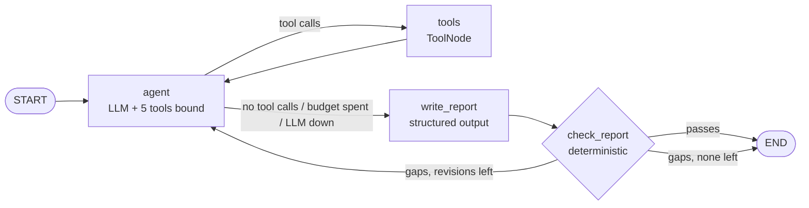
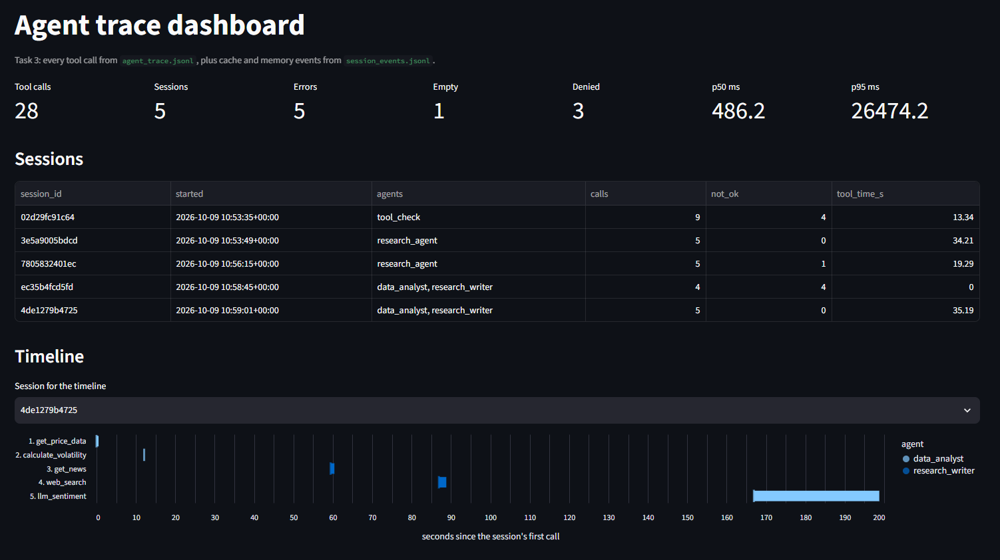
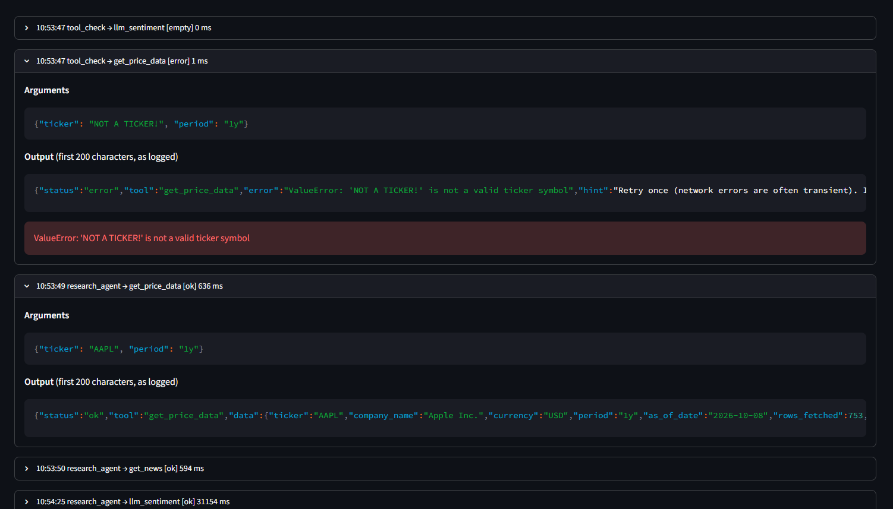

# Task 3 - Agentic Workflows: Multi-Agent Financial Research System

[](https://colab.research.google.com/github/GimsaraK/CDAZZDEV-MLE-Gimsara_Elgiriyage/blob/main/task3_agentic/task3_multi_agent.ipynb)

This task starts with a tool-using research agent (3A). It is later extended into a two-agent pipeline (Data Analyst and Research Writer) with structured handoffs, a critique loop, short-term and persistent memory, and full tool-call observability.

**Research query:**
> Analyse the current financial health and market sentiment of AAPL. Identify the top three risks to its share price over the next 90 days and suggest one data-driven hedge strategy.

**Status:** 3A implemented and executed (notebook sections 0-5); the main run is validated. 3B implemented and tested offline (notebook sections 6-9). 3C implemented and tested offline (notebook sections 10-13, plus the cache wrapper in §8). One full notebook re-execution with fresh LLM quota is still needed: the 3A section 5 fault run ran when every provider was at its daily limit, and sections 6-13 have not been executed live yet.

## Contents

| Path | Description |
|---|---|
| `task3_multi_agent.ipynb` | Main notebook, executed with the full agent trace visible |
| `src/config.py` | Every window, limit, threshold and path as a named constant |
| `src/schemas.py` | Pydantic models: tool envelope, the five tool payloads, `ResearchReport` |
| `src/tools.py` | The five tools (`ResearchTools`) and their LangChain wrappers (`build_tools`) |
| `src/volatility.py` | Volatility, expected move and price-band maths (pure functions) |
| `src/session.py` | Per-session store (tool history, cached prices) and fault injection |
| `src/tracing.py` | `agent_trace.jsonl` writer and `run_traced`, the wrapper every tool call goes through |
| `src/react.py` | Shared ReAct loop (agent turn <-> ToolNode) used by 3A and both 3B agents |
| `src/agent.py` | 3A LangGraph graph: agent, tools, write_report, check_report |
| `src/handoff.py` | 3B messages: `DataBrief`, `ClarificationRequest`, `ClarificationResponse`, `AgentMessage`, and the incorporation check |
| `src/multi_agent.py` | 3B parent graph, per-agent toolkits, `run_multi_agent` |
| `src/memory.py` | 3C follow-up on the checkpointed thread (`ask_followup`) |
| `src/cache.py` | 3C persistent cache keyed by ticker, market date and pipeline |
| `src/dashboard_data.py` | Data functions behind the Streamlit dashboard |
| `dashboard/app.py` | Streamlit trace dashboard (bonus) |
| `src/report.py` | Evidence digest, report checks, Markdown rendering |
| `src/prompts.py` | All prompt templates (system and user roles) |
| `src/llm.py` | Groq-first chat models with OpenRouter fallbacks |
| `src/display.py` | Live DECIDE / CALL / OBSERVE / REPLAN trace printer, the 3B `MultiAgentPrinter`, and tables |
| `tests/` | 141 offline tests (no keys, no network) |
| `logs/agent_trace.jsonl` | Every tool call: tool, args, output (truncated to 200 chars), duration, status |
| `logs/session_events.jsonl` | Cache and memory events (cache hit/miss/write, follow-up answered) |
| `outputs/` | Research reports (Markdown + JSON) from the notebook runs |
| `cache/` | Persistent research briefs: `<TICKER>_<YYYY-MM-DD>_<pipeline>.json` |

## Configuration

| Setting | Value |
|---|---|
| Agent framework | LangGraph (`StateGraph` built by hand, `ToolNode`) |
| Agent LLM | Groq `openai/gpt-oss-120b` (temperature 0.1; reasoning effort low for tool turns, medium for the report) |
| Fallback LLMs | Groq `openai/gpt-oss-20b` (its own daily quota), then OpenRouter `nvidia/nemotron-3-super-120b-a12b:free` and `google/gemma-4-31b-it:free` (both list tool support). `llm_sentiment` uses the same order. The trace and the report header show which model answered each turn. |
| Ticker | `AAPL` (any ticker works; the ticker is a parameter) |
| Web search | `ddgs`, the renamed `duckduckgo-search` package (same `DDGS` API) |

## Tools

All five tools return a `ToolResult` envelope: `status` (`ok` / `empty` / `error`), a typed payload in `data`, and on failure an `error` and a `hint` that names an alternative. Tools never raise. Market data, indicators, headlines and headline sentiment reuse the tested Task 1 modules (`task1_financial/src`).

| Tool | Returns | Fallbacks |
|---|---|---|
| `get_price_data(ticker, period)` | `PriceData`: price, period/YTD return, 52-week range, SMA-50/200, RSI-14, MACD, Bollinger, momentum, trend signals, fundamentals (P/E, margins, growth, debt/equity, FCF, beta), last 10 OHLCV bars | live -> Task 1 snapshot (read-only); invalid period -> error with the valid list |
| `get_news(ticker, n)` | `NewsList`: title, publisher, time, url | yfinance -> Google News RSS -> snapshot |
| `calculate_volatility(ticker, window)` | `VolatilityResult`: std(daily log returns, ddof=1) x sqrt(252), 20/60/252-day comparison, 1-year percentile and regime, max drawdown, 90-day 1-sigma move and price bands | reuses prices already in the session; invalid window -> error with the valid range |
| `llm_sentiment(headlines)` | `SentimentScore`: confidence-weighted score in [-1, 1], counts, strongest positive/negative headlines | Task 1 scorer: Pydantic validation, one repair call, then the other provider |
| `web_search(query)` | `SearchResults`: title, url, snippet, date | text -> news backend -> simplified query; retries on rate limits |

The agent receives each result as compact JSON (at most 2,500 characters), because Groq's free tier allows about 8k tokens per minute. The typed `ToolResult` travels with it as the `ToolMessage` artifact.

## Architecture

### 3A - Single research agent



- **Autonomy:** the system prompt gives the goal and what each tool returns, but no order. Routing follows the model's own tool calls; the order in the section 4 trace was chosen at run time, and the offline tests run the same graph with different scripted orders.
- **Observe and replan:** every tool result goes back into the conversation before the next decision. The trace numbers each decision that follows an observation. `check_report` adds a second loop: if the report is missing evidence, it sends the agent back with the specific gaps.
- **Report:** `write_report` fills the Pydantic `ResearchReport`, which has exactly three risks, each with at least one evidence item tied to a tool. It works from a digest of this session's successful tool results.
- **Report checks:** `check_report` verifies that:
  - each risk cites a tool that actually succeeded;
  - the financial-health metrics come from `get_price_data`;
  - sentiment comes from `llm_sentiment`;
  - the hedge's volatility and 90-day move match a `calculate_volatility` result within 0.5 percentage points;
  - every tool that only failed is named in `data_gaps`.
- **Error handling, in layers:**
  1. Each tool runs its own fallbacks.
  2. Any exception becomes an `error` envelope with a hint.
  3. `ToolNode` returns schema errors and unknown tool names to the model.
  4. Groq retries short 429s, then gpt-oss-20b and the OpenRouter models take over. A model that reports a daily limit is skipped for the rest of the session, and every model's error is logged, not just the first. Provider errors are reduced to the status and a reason, so account ids never reach logs or reports.
  5. Tool-round and revision budgets stop the run, with a recursion limit as the last stop.
  6. If every provider is down, the result is a `FinalReport` with `status="failed"`, not an exception.
- **Failure demo:** notebook section 5 injects a permanent `web_search` failure and a first-call `get_price_data` failure through `FaultConfig`. The faults go through the same code path as real exceptions.

### 3B - Multi-agent pipeline

| Agent | Role | Tool access | Output |
|---|---|---|---|
| Agent A - Data Analyst (`data_analyst`) | Quantitative analysis | `get_price_data`, `calculate_volatility`, `llm_sentiment` | `DataBrief` (structured JSON) |
| Agent B - Research Writer (`research_writer`) | Qualitative synthesis | `web_search`, `get_news` | Final `ResearchReport` |

```mermaid
sequenceDiagram
    participant O as orchestrator
    participant A as Agent A (data_analyst)
    participant B as Agent B (research_writer)
    O->>A: AnalystTask
    Note over A: ReAct: get_price_data, calculate_volatility
    A->>B: DataBrief (numbers from code, findings from A's LLM; no sentiment yet)
    Note over B: ReAct: get_news, web_search
    B->>A: ClarificationRequest (exactly one; e.g. score_headlines + B's headlines)
    Note over A: ReAct, same conversation: llm_sentiment on B's headlines
    A->>B: ClarificationResponse (typed values from A's new tool results)
    Note over B: ResearchReport, checked by check_report + check_incorporation
    B->>O: ResearchReport
```

- **How Agent A gets headlines:** A has `llm_sentiment` but no news access, so its first brief has no sentiment. B fetches headlines, and B's one clarification request carries them back to A, which scores them. Neither agent can produce the sentiment evidence alone.
- **Agents (`src/multi_agent.py`):**
  - The parent LangGraph graph runs `analyst_initial -> writer_research -> analyst_clarify -> writer_final`.
  - Each agent step is a ReAct loop (`src/react.py`, shared with 3A) with the agent's own tools, system prompt and round budget (A: 5, B: 5, A answering: 3 more). The LLM picks every tool call.
  - The agents keep separate conversations. A answers the clarification in its own history.
- **Structured handoffs (`src/handoff.py`):**
  - The messages are `AnalystTask`, `DataBrief`, `ClarificationRequest`, `ClarificationResponse` and `ResearchReport`, all Pydantic, each wrapped in an `AgentMessage` envelope (sender, recipient, kind, payload, timestamp).
  - Receivers re-validate payloads (`AgentMessage.open`). No string passing.
  - Numbers in the brief and in A's answer are filled from A's tool results in code; A's LLM writes only the interpretation.
- **Tool restriction, enforced three ways:**
  1. Each LLM is bound only to its own tool schemas.
  2. Each agent's `ToolNode` only holds its own tools, so a forged call comes back as an error.
  3. `ResearchTools(allowed=...)` refuses out-of-list calls inside `run_traced`, even direct code calls, and logs them as `ToolAccessError`.
- **Headline guard:** `llm_sentiment` only scores titles that `get_news` or `web_search` returned in the session. This was added after a live run in which Agent A invented headlines and scored them.
- **Critique loop:**
  - B always sends exactly one `ClarificationRequest`. Its LLM chooses the kind (`score_headlines`, `volatility_window`, `price_period`, `metric_check`), the parameters, the question and why it is needed.
  - A answers with its tools. If A's LLM does not run the needed tool, the orchestrator runs it with A's own toolkit (flagged `fulfilled_by: fallback`).
  - `check_incorporation` requires the final report to contain the value A returned and to explain it in `clarification_used`. One repair pass is allowed.
- **Message trace:**
  - `MultiAgentPrinter` prints `[A data_analyst]` / `[B research_writer]` DECIDE / CALL / OBSERVE lines and a `HANDOFF` block per message.
  - `outputs/<TICKER>_<date>_handoffs.json` stores every message.
  - `agent_trace.jsonl` records the calling agent per tool call.
- **Failure handling:**
  - Every model down, an invalid request, or an unanswered request each ends in a typed result: `status=failed`, a `fallback` request, or a `fallback` answer. None of them raises an exception.
  - The pipeline runs from query to report with no manual step.

### 3C - Memory and observability

- **Short-term memory (`src/memory.py`):**
  - The 3A research graph is compiled with a LangGraph checkpointer (`InMemorySaver`), and every run gets its own thread (thread_id = session id).
  - `ask_followup(run, question)` sends one more message on that thread in `followup` mode. The agent sees every earlier tool result in its own history and answers from it. Without a tool call the graph ends, so no new report is written.
  - The tools stay bound, with a budget of one tool round followed by one answer turn. So not calling a tool is the agent's own decision, and the notebook (§10) reports whether one ran: tool calls during the follow-up, `agent_trace.jsonl` lines before and after, and whether the answer cites the remembered values.
- **Persistent cache (`src/cache.py`):**
  - The file is `cache/<TICKER>_<YYYY-MM-DD>_<pipeline>.json`, where the date is the market's calendar date (US/Eastern) and the pipeline is `single_agent` or `multi_agent`.
  - `multi_agent_with_cache` / `research_with_cache` load today's brief if it exists and validates (zero tool calls). Otherwise they run the pipeline and write the report atomically.
  - What gets cached: a report that was validated, or accepted with warnings. A failed run is never cached. A corrupt, old-schema or mismatched file is a miss, never a crash. `force_refresh=True` always runs live.
  - In the notebook, §8 runs live and writes the cache, and §11 shows the second, same-day request hitting it.
- **Trace log:** `logs/agent_trace.jsonl` has one JSON object per tool call, including calls the access guard refused, and nothing else. `audit_trace()` checks every line: required fields present, output of 200 characters or less, and a duration of 0 or more.

```json
{"timestamp": "...", "session_id": "...", "agent": "data_analyst", "tool": "calculate_volatility",
 "args": {"ticker": "AAPL", "window": 20}, "status": "ok", "output": "<first 200 chars>", "duration_ms": 16.2}
```

- **Session events:** cache hits, misses, writes and skips, plus follow-up results, go to `logs/session_events.jsonl` (same session_id). An unchanged trace line count is then clean proof that no tool ran.

## Bonus - Observability Platform

A Streamlit dashboard reads `logs/agent_trace.jsonl` and `logs/session_events.jsonl`:

```
streamlit run task3_agentic/dashboard/app.py
```

- Filters by session, agent, tool and status.
- KPIs: calls, errors, empty, denied, p50/p95 duration.
- A per-session table.
- A timeline of each session's tool calls, coloured by agent.
- Every call's arguments and logged output.
- The cache and memory events.

The data functions (`src/dashboard_data.py`) are tested offline. Nothing in the dashboard calls an LLM or a data source.

Screenshots from the committed `agent_trace.jsonl` (the 2026-10-09 Colab run: 28 tool calls in 5 sessions).

The overview shows the KPIs, the per-session table, and the timeline of the two-agent pipeline run (`4de1279b4725`). Agent A fetches prices and volatility, Agent B fetches news and runs a search, then A scores B's headlines in the critique loop:



Each tool call expands to its arguments, its logged output (first 200 characters) and, for a failed call, the error:



## How to Run

1. Open the notebook with the Colab badge above. The first cell clones the repo and installs `requirements.txt`.
2. Add `GROQ_API_KEY` and, optionally, `OPENROUTER_API_KEY` (used as the fallback) in the Colab Secrets panel. Locally, put them in the repo-root `.env` (see `.env.example`).
3. Run all cells.

Offline tests: `python -m pytest task3_agentic/tests -q`, run from the repo root.

---

_Not investment advice. Produced for an engineering assessment only._
